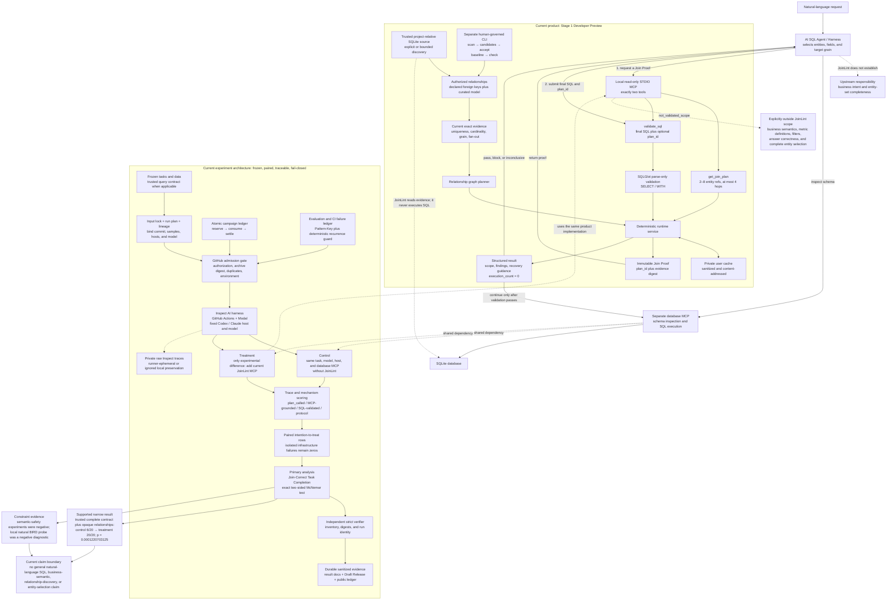

# Current product and experiment architecture

Status: reconciled on 2026-08-30 against the current Stage 1 Developer Preview
contract and the evaluation ledger. This page describes the current branch; it
does not turn Developer Preview behavior or bounded experiment results into a
general release claim.

Solid arrows are execution paths. Dashed arrows show a dependency or an
explicitly excluded responsibility.

The experiment treatment reuses the current MCP implementation rather than a
special evaluation-only product. The most important boundary is upstream:
JoinLint can prove relationships among requested physical entities, but it
cannot prove that the Agent selected every entity required by the user's intent.
